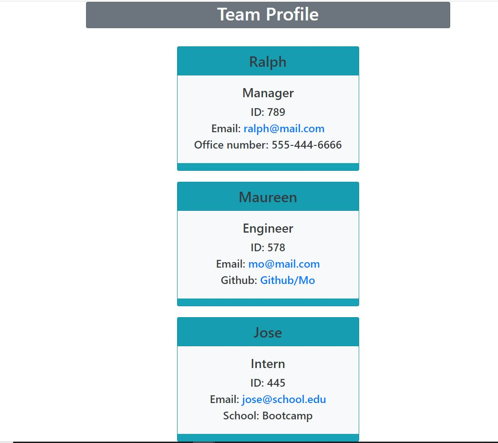

# Team Database

> A Node.js command line application that builds team cards based on input from user.

## User Story

> As a manager, I want a tool that displays my team's profiles in the form of a
> webpage.

## Acceptance Criteria

> When user answers a series of questions an output is cleanly displays as an webpage showing each team members card with their specific details.

## Technology Used

>+ [Node Package Manager](https://nodejs.org)
>+ [Video to Markdown!](https://video-to-markdown.netlify.app/)
>+ [Screencastify](https://www.screencastify.com/)

## Mockup

## Links

>+ **Github Repo:** <https://github.com/SarahKubik/TeamProfile.git>
